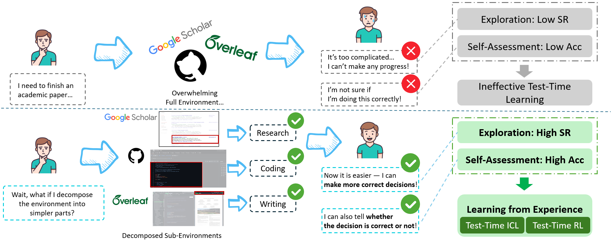

# TTED

## Description

This repository contains the official implementation of the paper **"Learning Simple Test-Time Environments for LLM Web Agents"**.

This repository is the public release of the paper and is intended solely to reproduce the experimental results reported in it. For all other content, please refer to the submission version.



> The preprint version is available in the `preprint` folder.

## Setup

### 1. Create a Python environment

We recommend using Conda to create isolated Python environments for model inference and training.

```bash
conda create -n project-inference python=3.11 -y
conda create -n project-training python=3.11 -y
```

### 2. Install public Python dependencies

```bash
conda activate project-inference
pip install --upgrade pip
pip install -r inference/requirements.txt

conda activate project-training
pip install --upgrade pip
pip install -r train/src/requirements.txt
```

Some packages, such as `flash-attn`, `deepspeed`, `vllm`, and `bitsandbytes`, require a compatible CUDA toolkit and may need to be installed separately depending on your system configuration.

### 3. Install local libraries

Install `train/src/verl` in editable mode for training:

```bash
cd train/src/verl
pip install --no-deps -e .
```

Alternatively, follow the official `verl` [installation instructions](https://verl.readthedocs.io/en/latest/start/install.html).

### 4. Configure WebArena benchmark environments

We use the **AgentLab** framework to set up WebArena and WorkArena.

1. Follow the [AgentLab](https://github.com/ServiceNow/AgentLab) setup instructions to deploy the AgentLab framework.
2. Deploy the WebArena services using the WebArena setup scripts provided by AgentLab.
3. Update the web service fields in `evaluation/webarena/config_webarena.json` for evaluation and `inference/config_inference.json` for experience collection, such as `WA_SHOPPING`, to match the actual WebArena service deployment.
4. To enable more accurate `fuzzy_match` behavior and more precise evaluation, change the LLM used for `fuzzy_match` from GPT-4 to GPT-5-mini in:

   ```text
   {your_environment}/webarena/llms/providers/openai_utils.py
   ```

   Modify the following function:

   ```python
   def generate_from_openai_chat_completion(
       messages: list[dict[str, str]],
       model: str,
       temperature: float,
       max_tokens: int,
       top_p: float,
       context_length: int,
       stop_token: str | None = None,
   ) -> str:
       client = get_openai_client()
       response = client.chat.completions.create(  # type: ignore
           model=model,  # Replace your model here
           messages=messages,
           temperature=temperature,
           max_tokens=max_tokens,
           top_p=top_p,
           stop=[stop_token] if stop_token else None,
       )
       ...
   ```
5. Due to network constraints, we use only a subset of WebArena for training and evaluation. See `webarena_tasklist.txt` for the selected tasks. In the environment, modify the following file to configure the evaluation tasks as needed:

   ```text
   {your_environment}/browsergym/experiments/benchmark/configs.py
   ```

### 5. Configure the WorkArena benchmark environment

AgentLab runs WorkArena through BrowserGym. Follow the current [WorkArena setup instructions](https://github.com/ServiceNow/WorkArena#getting-started) to obtain access to the ServiceNow instance pool and install the benchmark environment:

1. Request access to the gated [WorkArena Instances](https://huggingface.co/datasets/ServiceNow/WorkArena-Instances) repository on Hugging Face. Fill out the access form, accept the terms, and wait for approval.
2. Authenticate the machine that will run WorkArena with the approved Hugging Face account. Either log in interactively or provide a Hugging Face access token:

   ```bash
   huggingface-cli login

   # Alternatively
   export HUGGING_FACE_HUB_TOKEN=<your_huggingface_token>
   ```
3. If you are upgrading from an older WorkArena installation that used a personal ServiceNow Developer Instance, unset the legacy WorkArena variables (including `SNOW_INSTANCE_URL`, `SNOW_INSTANCE_UNAME`, and `SNOW_INSTANCE_PWD`) so that WorkArena uses the managed instance pool.
4. Install WorkArena in the same Python environment as AgentLab and install the Playwright browsers:

   ```bash
   pip install browsergym-workarena
   playwright install
   ```

After setup, select the required WorkArena benchmark (for example, `workarena_l1`, `workarena_l2`, or `workarena_l3`) in `evaluation/workarena/config_workarena.json`. Instance access is resolved using the authenticated Hugging Face account, so the legacy `SNOW_INSTANCE_*` values should not be added to this configuration file.

## Running Experiments

This section describes how to run the main experiments in the paper.

### Configuration

Experience collection, WebArena evaluation, and WorkArena evaluation use separate configurations and launchers:

- `inference/config_inference.json` and `inference/run_inference.py`
- `evaluation/webarena/config_webarena.json` and `evaluation/webarena/run_webarena.py`
- `evaluation/workarena/config_workarena.json` and `evaluation/workarena/run_workarena.py`

Each configuration registers environment variables before AgentLab is imported, including:

- WebArena service URLs, such as `WA_SHOPPING`, `WA_SHOPPING_ADMIN`, `WA_REDDIT`, `WA_GITLAB`, `WA_MAP`, and `WA_FULL_RESET`.
- Experiment output directory, `AGENTLAB_EXP_ROOT`.
- OpenAI-compatible model settings, such as `OPENAI_BASE_URL`, `EVAL_OPENAI_API_BASE`, and `EVAL_MODEL_NAME`.
- Agent module, class name, and LLM temperature under the `agent` field.
- AgentLab benchmark settings under the `study` field.

Each launcher defaults to the configuration beside it, registers all variables under `env`, dynamically loads the specified agent, creates an AgentLab study, and runs the evaluation:

```bash
python inference/run_inference.py
python evaluation/webarena/run_webarena.py
python evaluation/workarena/run_workarena.py
```

The Hugging Face token required by WorkArena should be provided through the shell rather than committed to `config_workarena.json`:

```bash
export HUGGING_FACE_HUB_TOKEN=<your_huggingface_token>
```

The `env` field contains two groups of OpenAI-compatible LLM settings:

```json
{
  "OPENAI_API_KEY": "key",
  "OPENAI_BASE_URL": "base_url",

  "EVAL_OPENAI_API_KEY": "key",
  "EVAL_OPENAI_API_BASE": "base_url",
  "EVAL_MODEL_NAME": "qwen3-8b"
}
```

`OPENAI_API_KEY` and `OPENAI_BASE_URL` are used by the WebArena evaluator. In WebArena, some text-based answers are evaluated through LLM-based fuzzy matching, and these variables specify the LLM endpoint used for that benchmark-internal answer-matching process.

`EVAL_OPENAI_API_KEY`, `EVAL_OPENAI_API_BASE`, and `EVAL_MODEL_NAME` are used by the evaluated agent itself. These variables specify the OpenAI-compatible endpoint and model name used by the agent for goal decomposition, action generation, and self-assessment.

Set the evaluated or data-collection agent's module and LLM temperature under the corresponding configuration's `agent` field. For TTED, use:

```json
{
  "agent": {
    "module": "evaluation.webarena.agents.TTED",
    "class_name": "CustomAgentArgs",
    "temperature": 0.0
  }
}
```

Use `evaluation.workarena.agents.TTED` in the WorkArena configuration.

The configured temperature is used for all OpenAI-compatible LLM calls made by the selected agent. It does not change the temperature of WebArena's benchmark-internal fuzzy-match evaluator.

Additionally, place the tokenizer corresponding to the model used for data collection, evaluation, and training in `utils/tokenizer`. In our experiments, we use the [Qwen3-8B tokenizer](https://huggingface.co/Qwen/Qwen3-8B), which can be downloaded manually.

### Experience Data Collection from Test-Time Environments

1. Update `inference/config_inference.json`.

   The file must specify the evaluation environment, LLM API key, and other settings. Set `module` under the `agent` field to select the desired data-collection method:

   ```text
   TTT (w/ GT)       -> inference.agents.TTT_with_ground_truth_sampling
   TTT (w/o GT)      -> inference.agents.TTT_without_ground_truth_sampling
   TTRL (w/ Decomp.) -> inference.agents.TTRL_decomposition_sampling
   TTRL (w/o Decomp.)-> inference.agents.TTRL_sampling
   TTED              -> inference.agents.TTED_sampling
   ```
2. Collect samples from the environment.

   Use the different multi-agent framework implementations in `inference/agents` to collect data:

   ```bash
   python inference/run_inference.py
   ```

   After sampling is complete, results are written to the directory specified by `AGENTLAB_EXP_ROOT` in `config_inference.json`. A single WebArena task trajectory has the following structure:

   ```text
   [AGENTLAB_EXP_ROOT]/
   └── [EVALUATION_ID]/
       ├── webarena.0/
       │   ├── exp_args.pkl
       │   ├── experiment.log
       │   ├── goal_object.pkl.gz
       │   ├── package_versions.txt
       │   ├── summary_info.json
       │   ├── step_0.pkl.gz
       │   ├── screenshot_step_0.png
       │   ├── step_1.pkl.gz
       │   ├── screenshot_step_1.png
       │   ├── ...
       │   ├── step_N.pkl.gz
       │   └── screenshot_step_N.png
       ├── webarena.1/
       │   └── ...
       └── ...
   ```

   `step_N.pkl.gz` stores the interaction trajectory for step `N`, and `screenshot_step_N.png` stores the corresponding page screenshot. `summary_info.json` stores the reward returned by the environment.
3. Extract interaction data.

   To parse the interaction data in `step_N.pkl.gz`, run the following command from the repository root:

   ```bash
   python -m analysis.result_parser --record_dir "[AGENTLAB_EXP_ROOT]/[EVALUATION_ID]"
   ```

   After the command finishes, `message_record.json` and `message_record.txt` are generated in each task directory. The former records the inputs and outputs of every execution stage, while the latter organizes them into a human-readable format for inspection.

### Model Test-Time Training on WebArena

1. Preprocess the collected experience data into another folder for model training.

   ```bash
   python train/scripts/data_proc/proc_RL_TTED.py

   # Other baselines
   python train/scripts/data_proc/baselines/proc_SFT_w_GT.py
   python train/scripts/data_proc/baselines/proc_RL_w_GT.py
   python train/scripts/data_proc/baselines/proc_RL_TTT.py
   bash train/scripts/data_proc/baselines/proc_RL_TTRL.sh
   ```

   Modify the script parameters according to your data folder structure and file names.
2. Train the model.

   First, extract hidden states from the sampled data to accelerate training:

   ```bash
   # Host the pretrained model to obtain raw probabilities and hidden states
   vllm serve Qwen3-8B --reasoning-parser qwen3 --no-enable-prefix-caching --logprobs-mode processed_logprobs

   # Run in another process
   python train/scripts/model_training/offline_prepare_verl_shards.py
   ```

   Then train the model:

   ```bash
   bash train/scripts/model_training/train_TTED.sh

   # Other baselines
   bash train/scripts/model_training/baselines/train_SFT.sh <num_gpus> <save_path>
   bash train/scripts/model_training/baselines/train_TTT.sh
   bash train/scripts/model_training/baselines/train_TTRL.sh
   ```

   Modify the script parameters according to your data folder structure and file names.
3. Post-process the model by merging checkpoint files into deployable model files.

   ```bash
   python -m verl.model_merger merge \
       --backend fsdp \
       --local_dir <checkpoint_dir> \
       --target_dir <model_dir>
   ```

### Model Evaluation on CompWob+, WebArena, and WorkArena

#### 1. Deploy the model.

```bash
vllm serve merged_hf_model --reasoning-parser qwen3
```

#### 2. Evaluation

##### For Webarena

1. Update `evaluation/webarena/config_webarena.json`.

The file must specify the evaluation environment, LLM API key, and other settings. Set `module` under the `agent` field to select the desired evaluation method:

```text
WebArena ReAct Agent (for TTT and TTRL w/o Decomposition) -> evaluation.webarena.agents.action_summary
WebArena TTED (for TTRL w/ Decomposition and TTED)        -> evaluation.webarena.agents.TTED
WorkArena ReAct Agent                                     -> evaluation.workarena.agents.action_summary
WorkArena TTED                                            -> evaluation.workarena.agents.TTED
```

Then run:

```bash
python evaluation/webarena/run_webarena.py
```

2. Analyze the results from the repository root:

```bash
python -m analysis.check_result --record_dir "[AGENTLAB_EXP_ROOT]/[EVALUATION_ID]"
```

##### For WorkArena

Update `evaluation/workarena/config_workarena.json`, then run:

```bash
python evaluation/workarena/run_workarena.py
```

##### For CompWob+

See `evaluation/compwob+/README.md` for detailed evaluation instructions.

## Resources

### CompWob+ Dataset

- [Download CompWoB+ from ModelScope](https://www.modelscope.cn/datasets/JunxuanLi/CompWoB-Plus)

### Test-Time Trained Models

| Training method                                 | Model                                                                                              |
| ----------------------------------------------- | -------------------------------------------------------------------------------------------------- |
| Reinforcement learning with ground-truth labels | [Qwen3-8B-RL-W-GT-WebArena](https://www.modelscope.cn/models/JunxuanLi/Qwen3-8B-RL-W-GT-WebArena)   |
| Supervised fine-tuning with ground-truth labels | [Qwen3-8B-SFT-W-GT-WebArena](https://www.modelscope.cn/models/JunxuanLi/Qwen3-8B-SFT-W-GT-WebArena) |
| Test-Time Training (TTT)                        | [Qwen3-8B-TTT-WebArena](https://www.modelscope.cn/models/JunxuanLi/Qwen3-8B-TTT-WebArena)           |
| Test-Time Reinforcement Learning (TTRL)         | [Qwen3-8B-TTRL-WebArena](https://www.modelscope.cn/models/JunxuanLi/Qwen3-8B-TTRL-WebArena)         |
| Test-Time Environment Decomposition (TTED)      | [Qwen3-8B-TTED-WebArena](https://www.modelscope.cn/models/JunxuanLi/Qwen3-8B-TTED-WebArena)         |

## Citation

If you find the code useful, please cite the following paper:

```bibtex
@misc{li2026learning,
  title  = {Learning Simple Test-Time Environments for LLM Web Agents},
  author = {Junxuan Li and Zijun Liu and Ziyi Huang and Peng Li and Yuzhou Liu and Ming Yan and Yang Liu},
  year   = {2026},
  note   = {Preprint}
}
```

## Acknowledgements

We thank the authors and contributors of [CompWoB](https://github.com/google-research/google-research/tree/master/compositional_rl/compwob) for the compositional web-automation benchmark, [WebArena](https://github.com/web-arena-x/webarena) and [WorkArena](https://github.com/ServiceNow/WorkArena) for the realistic web environment, [AgentLab](https://github.com/ServiceNow/AgentLab) for the web-agent evaluation framework, and [verl](https://github.com/verl-project/verl) for the reinforcement-learning training infrastructure that supported this work.
